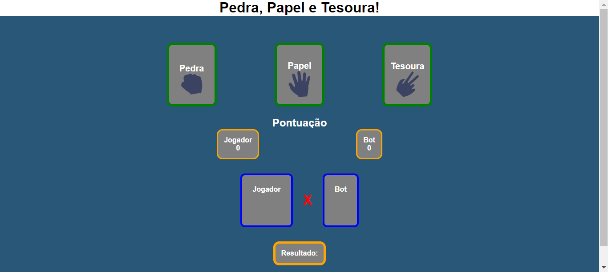

# JOGO DO JOKENPO EM HTML
☑️JOGO EM HTML/CSS/JS.

   

## DESCRIÇÃO:
Este é um jogo simples de Pedra, Papel e Tesoura que é jogado no navegador.

- Quando o jogador escolhe um item, o computador faz uma escolha aleatória.
- Com base nas escolhas do jogador e do computador, o jogo determina o vencedor e atualiza os pontos de acordo.
- O resultado é exibido em um parágrafo no HTML.

## NÃO SABE?
- Entendemos que para manipular arquivos em `HTML`, `CSS` e outras linguagens relacionadas, é necessário possuir conhecimento nessas áreas. Para auxiliar nesse aprendizado, oferecemos cursos gratuitos disponíveis:
* [CURSO DE HTML E CSS](https://github.com/VILHALVA/CURSO-DE-HTML-E-CSS)
* [CURSO DE JAVASCRIPT](https://github.com/VILHALVA/CURSO-DE-JAVASCRIPT)
* [CONFIRA MAIS CURSOS](https://github.com/VILHALVA?tab=repositories&q=+topic:CURSO)

## CREDITOS:
- [PROJETO CRIADO PELO "jpbrab0"](https://github.com/jpbrab0/pedra-papel-tesoura)
- [PROJETO EDITADO PELO VILHALVA](https://github.com/VILHALVA)
- [ESTÁ DISPONIVEL NO SITE](https://vilhalva.github.io/STYLER/STYLER.html)